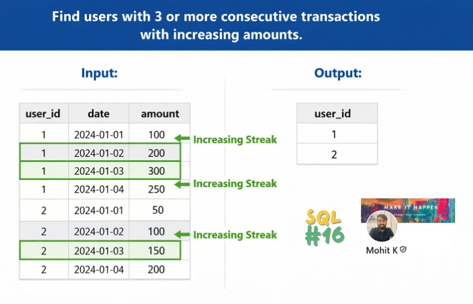

# CTE Practice Questions

## Medium Level (Foundational Transformation Thinking)

### Q1. Customer Lifetime Value Segmentation

You have an `orders` table:

```
orders(order_id, customer_id, order_date, amount)
```

Task:

- Compute total revenue per customer
- Calculate average customer revenue
- Return customers whose revenue is above average

(Use multiple CTE layers: aggregation → benchmark → filter)

### A1. SQL Query

```sql
with total_revenue as (
    select customer_id, sum(amount) as total_revenue
    from orders
    group by customer_id
),
avg_revenue as (
    select avg(total_revenue) as avg_revenue
    from total_revenue
)
select customer_id, total_revenue
from total_revenue t
cross join avg_revenue a
where t.total_revenue > a.avg_revenue
```

### Lesson:

> Mixing row-level metrics (order amount) with entity-level metrics (customer revenue). Using avg(amount) gives AOV (Average Order Value), but the requirement was ACV (Average Customer Value).

### How to not repeat this mistake?

> While calculating average think what this gives. Like what "avg(amount)" gives -> average revenue per order. what avg(total_revenue) gives average revenue per customer. what avg(monthly_sales) gives average revenue per month.

---

### Q2. Monthly Active Users Trend

Table:

```
events(user_id, event_date)
```

Task:

- Calculate monthly active users
- Show each month’s MAU and previous month’s MAU
- Include MoM change

(Hint: create monthly aggregation CTE, then apply window functions)

---

### A2. SQL Query

```sql
with monthly_users as (
    select date_trunc('month', event_date) as month, count(distinct user_id) as active_users
    from events
    group by date_trunc('month', event_date)
),
lagged as (
select month, active_users as cm_active_users,
lag(active_users) over (order by month) as pm_active_users
from monthly_users)

select month, cm_active_users, pm_active_users,
case when pm_active_users is null then null
else round(((cm_active_users - pm_active_users)*1.0)/pm_active_users,2) as mom_change
from lagged
```

### Lessons

> Handling of first null in lag window function
> lag as a separate cte to make query more clear

### Q3. First Order After Signup

Tables:

```
users(user_id, signup_date)
orders(order_id, user_id, order_date)
```

Task:
For each user, find their first order **after** signup.

(Requires filtering then ranking using CTEs)

---

### A3. SQL Query

```sql
with filtered_orders as (
    select order_id, o.user_id, order_date, signup_date,
    row_number() over(partition by user_id order by order_date) as rn
    from orders o
    join users u on o.user_id = u.user_id and o.order_date >= u.signup_date
)
select user_id, signup_date, order_id, order_date
from filtered_orders
where rn=1
```

### Lesson

> First filter the data and then apply window functions

## Advanced Level (Business Analytics Patterns)

### Q4. Cohort Retention Table

Table:

```
orders(user_id, order_date)
```

Task:

- Assign each user a cohort month (first purchase month)
- Calculate retention: how many users return in later months

(Use sequential CTE steps: first_purchase → monthly_orders → retention join)

---

### A4. SQL Query

```sql
with first_orders as (
    select date_trunc('month', min(order_date)) as cohort_month, user_id
    from orders
    group by user_id
),
all_orders as (
    select cohort_month, user_id, date_trunc('month', order_date) as order_month,
    extract(YEAR from age(date_trunc('month', order_date), cohort_month))*12 + extract(MONTH from age(date_trunc('month', order_date),cohort_month)) as months_since_cohort
    from first_orders f
    join orders o on f.user_id = o.user_id
)
select cohort_month, months_since_cohort, count(distinct user_id) as retained_users
from all_orders
group by cohort_month, months_since_cohort
order by cohort_month, months_since_cohort
```

### Lessons

> How to find difference in months from 2 dates
> how cohort retention is calculated over months

### Q5. Top 20% Revenue Products (Pareto Analysis)

Table:

```
sales(product_id, revenue)
```

Task:

- Calculate total revenue per product
- Compute cumulative revenue share
- Return products contributing to top 80% of revenue

(Multi-stage CTE pipeline with cumulative window logic)

---

### A5. SQL Query

```sql
with eighty_percent_revenue as (
    select 0.8*(sum(revenue)) as threshold_revenue
    from sales
),
revenue_per_product as (
    select product_id, sum(revenue) as product_revenue
    from sales
    group by product_id
),
cumulative_revenue as (
    select product_id, product_revenue,
    sum(product_revenue) over(order by product_revenue desc) as cumulative_revenue
    from revenue_per_product
)
select product_id, product_revenue, cumulative_revenue, threshold_revenue
from cumulative_revenue c
cross join eighty_percent_revenue e
where cumulative_revenue <= threshold_revenue
```

### Lessons

> Reference correct tables in the joins
> Pareto Analysis

### Q6. Consecutive Purchase Detection

Table:

```
orders(user_id, order_date)
```

Task:
Find users who placed orders in **two consecutive months**.

(Use month-level CTE + self-join logic)

---

### A6. SQL Query

```sql
with months as (
    select user_id, date_trunc('month', order_date) as order_month
    from orders
    group by user_id,  date_trunc('month', order_date)
),
lagged_months as (
    select user_id, order_month,
    lag(order_month) over(partition by user_id order by order_month) as prev_month
    from months
),
diff_months as (
    select user_id, order_month, prev_month,
    case when order_month = prev_month + INTERVAL '1 month' then 1 else 0 end as month_ind,
    sum(case when order_month = prev_month + INTERVAL '1 month' then 0 else 1 end) over (partition by user_id order by order_month) as group_id
    from lagged_months
)
select user_id, group_id, sum(month_ind)
from diff_months
group by user_id, group_id
having sum(month_ind) >= 1
```

### Lesson

> Group/Island Problem - To a Senior Analyst, this is known as a "Gaps and Islands" problem. To "reset" a sum when a zero appears, you have to create a "Group ID" that changes every time a zero occurs.
> Row number magic to create groups or islands. My confusion, what when streak breaks, then also will subtracting row_number from order_date work. Answer is "Yes" because if next month is consecutive then it will have same group as prev_month.
> Consecutive Months = Group/Island = Row Number Subtraction Magic

## Advanced+ (Engineering + Analytical Thinking)

### Q7. Detect Churned Users

Tables:

```
orders(user_id, order_date)
```

Task:

- Define churn as: no order in the last 3 months
- Return users who were active before but now churned

(Use CTE for last activity and comparison against max date)

### A7. SQL Query

```sql
with max_orders as (
    select user_id, max(order_date) as max_order_date
    from orders
    group by user_id
)
select user_id
from max_orders m
where max_order_date < CURRENT_DATE - INTERVAL '3 months'
```

### Lessons

> Different types of Churn

| Churn Type         | Definition (Short)                                       | Time Reference         | Key Condition Logic                                       | Core SQL Pattern (Conceptual)                                 |
| ------------------ | -------------------------------------------------------- | ---------------------- | --------------------------------------------------------- | ------------------------------------------------------------- |
| Rolling Churn      | No activity in last N time window                        | Relative to today      | last_activity < CURRENT_DATE - interval                   | MAX(order_date) per user → filter by cutoff date              |
| Period Churn       | Active in previous period but inactive in current period | Fixed calendar periods | Active in T AND NOT active in T+1                         | prev_period_users LEFT JOIN curr_period_users → IS NULL       |
| Cohort Churn       | Users from a cohort who stop returning over lifecycle    | User-relative timeline | No activity after month_k since cohort                    | cohort_month + months_since_cohort → retention drop detection |
| Subscription Churn | Explicit cancellation of subscription                    | Event-driven (status)  | status = 'cancelled' OR end_date IS NOT NULL              | Filter subscription table on cancellation/end_date            |
| Soft Churn         | Temporarily inactive but may return later                | Behavior-based window  | inactivity gap >= threshold but later reactivation exists | Detect inactivity gaps using LAG(order_date)                  |
| Hard Churn         | Permanently inactive after last activity                 | Long-term inactivity   | No future activity after last observed event              | Last activity date + no future records                        |
| Revenue Churn      | Loss of paying users or drop in revenue contribution     | Period or lifecycle    | Previous revenue > 0 AND current revenue = 0              | Compare revenue per user across periods                       |
| Product Churn      | Stops using a specific feature/product                   | Feature-level timeline | Previously used feature but no longer uses it             | Feature usage events grouped by user & period                 |

---

### Q8. Rolling 3-Month Revenue Per Product

Table:

```
sales(product_id, sale_date, revenue)
```

Task:

- Compute monthly revenue per product
- Then calculate rolling 3-month revenue window

(CTE for monthly aggregation → window frame logic)

### A8. SQL Query

```sql
with monthly_revenue as (
    select product_id, date_trunc('month', sale_date) as order_month, sum(revenue) as revenue_per_month
    from sales
    group by product_id, date_trunc('month', sale_date)
)
select product_id, order_month, revenue_per_month,
sum(revenue_per_month) over(partition by product_id order by order_month rows between 2 preceding and current row) as rolling_sum
from monthly_revenue
```

### Lessons

> Remember to use partition by with rows between 2 preceding and current row

---

## Interview-Level (Complex Multi-Step Pipelines)

### Q9. Funnel Conversion Analysis

Table:

```
events(user_id, event_name, event_time)
```

Events: `signup`, `view_product`, `purchase`

Task:
Build a funnel showing:

- Total users who signed up
- Of those, how many viewed a product
- Of those, how many purchased

(CTEs should isolate each funnel stage and join sequentially)

### A9. SQL Query

```sql
with signups as (
    select user_id as signed_user_id, min(event_time) as signed_time
    from events
    where event_name = 'signup'
    group by user_id
),
viewed as (
    select signed_user_id, signed_time, min(event_time) as viewed_time
    from signups s
    left join events e on s.signed_user_id = e.user_id and e.event_name = 'view_product' and event_time >= signed_time
    group by signed_user_id, signed_time
),
purchased as (
    select signed_user_id, signed_time, viewed_time, min(event_time) as purchased_time
    from viewed v
    left join events e on v.signed_user_id = e.user_id and e.event_name = 'purchase' and event_time >= viewed_time
    group by signed_user_id, signed_time, viewed_time
)
select sum(case when signed_time is null then 0 else 1 end) as signed_users, sum(case when viewed_time is null then 0 else 1 end) as viewed_users,
sum(case when purchased_time is null then 0 else 1 end) as purchased_users
from purchased
```

### Lessons

> In Funnel Analysis, try to show one row per user that shows the journey of user_id. Then aggregate it as you want.

---

### Q10. Revenue Drop Root Cause by Category

Tables:

```
orders(order_id, product_id, order_date, revenue)
products(product_id, category)
```

Task:

- Calculate monthly revenue per category
- Compare latest month vs previous month
- Return categories where revenue dropped and by how much

(Requires layered CTEs: monthly revenue → lag comparison → final filter)

```sql
with monthly_revenue as (
    select category, date_trunc('month', order_date) as month, sum(revenue) revenue_per_month
    from products p
    join orders o on p.product_id = o.product_id
    group by category, date_trunc('month', order_date)
),
change_in_revenue as (
    select category, month as curr_month, revenue_per_month, lag(revenue_per_month) over(partition by category, month) as prev_month_revenue ,
    revenue_per_month - lag(revenue_per_month) over(partition by category order by month) as change_in_revenue
    from monthly_revenue
)
select category, curr_month, revenue_per_month, prev_month_revenue, change_in_revenue
from change_in_revenue
where change_in_revenue < 0
order by categroy, curr_month;
```

---

# How to Use These Questions

For each problem:

1. First attempt using nested subqueries (messy approach)
2. Refactor into 2–4 CTE stages:
   - base_data
   - aggregated_metrics
   - window_calculations
   - final_output

3. Ensure each CTE represents one logical transformation step

This workflow builds the mental model:

> CTE = readable analytical pipeline

---

If you want, next I can provide:

- Expected schema assumptions
- Difficulty tagging (Medium / Hard / FAANG-level)
- Or full solutions after you attempt them.

[text](https://learnsql.com/blog/sql-window-functions-practice-exercises/)

### Question - Increasing Streak



```sql
with lagged_amount as (
    select user_id, date, amount as curr_amount,
    lag(amount) over(partition by user_id order by date) as prev_amount
    from users
),
indicators as (
    select user_id, date, curr_amount, prev_amount,
    case when prev_amount is null or prev_amount < curr_amount then 0 else 1 end as ind
    from lagged_amount
),
groups as (
    select user_id, date, curr_amount, prev_amount, ind, sum(ind) over(partition by user_id order by date) as groups
    from indicators
),
streaks as (
    select user_id, count(groups) as streak_count
    from groups
    group by user_id, groups
)
select distinct user_id
from streaks
where streak_count >= 3
```

with joined_table as (
select u.user_id, u.signup_date, txn_date, amount
from users u
left join transactions t on u.user_id = t.user_id
),
ranks as (
select user_id, signup_date, txn_date, amount,
row_number() over (partition by user_id order by txn_date desc) as rn
from joined_table
where txn_date < signup_date or txn_date is null)
select user_id, signup_date, txn_date, amount
from ranks
where rn=1

### Question

> Write an SQL query to display the records [in the Stadium table] with three or more rows with consecutive id’s, and the number of people is greater than or equal to 100 for each. Return the result table ordered by visit_date in ascending order.

```sql
with lagged_table as (
    select id, visit_date, people, lag(id) over(order by id) as lag_id,
    case when lag(id) over(order by id) is null or lag(id) over(order by id) + 1 = id then 0 else 1 end as ind
    from stadium
    where people >= 100
),
groupings as (
    select id, visit_date, people, sum(ind) over(order by id) as groups
    from lagged_table
),
grouped_data as (
    select groups, count(*) as count_all
    from groupings
    group by groups
    having count(*) >= 3
)
select id, visit_date, people
from groupings l
join grouped_data g on l.groups = g.groups
order by visit_date
```

```sql
with ranks as (
    select emp_id, work_date, row_number() over(partition by emp_id order by work_date) as rn,
    work_date - row_number() over(partition by emp_id order by work_date) as group_id
    from attendance
)
select emp_id, min(work_date) as start_date, max(work_date) as end_date, count(*) as streak_length
from ranks
group by emp_id, group_id
```

## LC 1454 Active Users

```sql
with rankings as (
    select id, login_date, row_number() over (partition by id order by login_date) as rn
    from logins
),
groupings as (
    select id, login_date, login_date - rn * Interval '1 day' as groups
    from rankings
),
streaks as (
    select id, min(login_date) as streak_start_date, max (login_date) as streak_end_date, count(*) as streaks
    from groupings
    group by id, groups
    having count(*) >= 5
)
select distinct a.id, a.name
from accounts a
join streaks s on a.id = s.id
```

## Suspicious Raid Transactions

> Correct but not optimised

```sql
with intervals as (
    select a.user_id, a.txn_time as start_time,
    b.txn_time, a.amount
    from transactions a
    join transactions b
    on a.user_id = b.user_id and (b.txn_time >= a.txn_time and b.txn_time <= a.txn_time + INTERVAL '10 minutes')
),
select user_id, start_time, max(txn_time) as end_time, count(*) as txn_count
from intervals
group by user_id, start_time
having count(*) >= 3

```

> Optimised using window functions

```sql
with burst_counts as (
    select user_id, txn_time,
    count(*) over (
        partition by user_id
        order by txn_time
        range between current row and interval '10 minutes' following
    ) as bursts,
    max(txn_time) over(
        partition by user_id
        order by txn_time
        range between current row and interval '10 minutes' following
    ) as end_time
    from transactions
)
select user_id, txn_time as start_time, end_time, bursts
from burst_counts
where bursts >= 3
order by user_id, start_time
```
